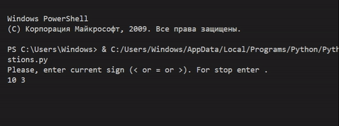
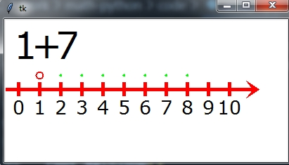
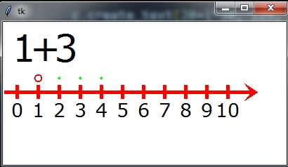
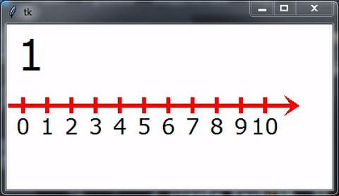

# Дійсні числа


## Натуральні числа
**Натуральні числа** - це ті, якими ми рахуємо предмети: 1,2,3,4....  
Вони нам потрібні, щоб розраховувати кількість предметів, а також площу, час, відстань, температуру, тощо.

Що дозволяють зробити натуральні числа?  
Вони необхідні, щоб закодувати кількість предметів, записати це кодування, для того, щоб зберегти значення.  
Ви можете записти кількість яблук, конфет або олівців.  


Скільки яблук?  


Відповідь:
**7**

|Зображення|Кількість яблук|
|:---:|:---:|
| | 2 |
| | 3 |
| | 4 |
| |  |
| |  |
| |  |
| |  |
| |  |
| |  |
| |  |

## Порівняння груп предметів
Важливим рішенням є порівняння кількості елементів в декілько групах.  Для цього використовується знак менше (<), більше (>) та дорівнює (=).  
Знак має бути направлений меншим кінцем до групи в якій менше елементів.

|Група 1|Знак|Група 2|
|:---:|:---:|:---:|
|| < ||
|| > ||
|| = ||
||  ||
||  ||
||  ||
||  ||
||  ||
||  ||
||  ||
||  ||


## Порівняння чисел
Наприклад, до вас на свято завітали ваши родичі і ви збираєтесь всі разом їхати до аквапарку. У вашого батька є автомобіль. Проте в автомобіль може сісти лише 5 людей. Для того, щоб зрозуміти, чи всі помістяться в автомобіль (чи треба виклакати таксі) необхідно полічити всіх гостей, а далі - порівняти отримане значення із числом 5. Якщо кількість гостей та вашої родини більше 5, то треба викликати таксі.
Тобто, що вдома є ваш тато та мама, ви, а до вас завітала ваша тітка із вашим двоюрідним братом - то ви зможете разом поїхати на татовій машині.
Але, якщо до вас завітли ще й бабуся із дідусем - то вже треба забезпечити додатковий транспорт.

Математика - дуже важлива і дозволяє вам приймати в житті вірні рішення.

Чи треба викликати таксі, якщо всього на святи присутні 4,5,7,10 гостей?
Якщо перефразувати математично, то який знай треба поставити між цифрами:
|Кількість гостей | знак | кількість місць в машині|Треба таксі?|
|:---:|:---:|:---:|:---:| 
|4| < |    5|Не треба|
|5| = |    5|Не треба|
|7| > |    5|Треба|
|6|  |    5|Треба|
|9|  |    5|Треба|
|3|  |    5|Треба|
|10|  |    5|Треба|
|12|  |    5|Треба|
|15|  |    5|Треба|

Який знак показує, що нам треба 

## Додаткові завдання:
1. Вирішіть попереднє завдання за умови, що у вашого батька Mitsubishi Outlander на 7 місць
   
2. Вирішіть попереднє завдання за умови, що у вашого батька Mitsubishi Outlander на 7 місць, а також до вас завітав ваш дядко в якого автомобіль на 5 місць.

## Python
```python
import random


while True:
    a = random.randint(1, 10)
    b = random.randint(1, 10)

    si = input("Please, enter current sign (< or = or >). For stop enter .\n"+str(a)+" "+str(b)+"\n")
    # print(a,b)
    if si == '.':
        break
    if a>b and si == '>':
        print("true")
    elif a<b and si == '<':
        print("true")
    elif a==b and si == '=':
        print("true")
    else:
        print("false")
```



## Складання
Із числами можна проводити дії.  
  
Для того, щоб обрахунки - використовують числову пряму. Якщо ви хочете додати до числа 1 значення 3, вам необхідно знайти пункт, що відповідає числу 1 та зробити 3 кроки вправо. Отримуємо 4.  


|Додатне 1| Знак | Додатне 2 | = | результат |
|:---:|:---:|:---:|:---:|:---:|
| 1 | + | 3 | = | 4 |
| 1 | + | 7 | = | 8 |
| 3 | + | 4 | = | 7 |
| 2 | + | 2 | = |  |
| 3 | + | 5 | = |  |
| 5 | + | 3 | = |  |
| 6 | + | 3 | = |  |
| 2 | + | 5 | = |  |
| 5 | + | 4 | = |  |
| 5 | + | 5 | = |  |

## Демонстрація.
Для того, щоб зробити відповідні оператори - використайте заготовлену програму на Python.  Для цього - скопіюйте в 2 файли:

1. Встановити Python на комп'ютер
2. Встановити Git Bash
3. Встановити бібліотеку TKinter (pip install tk)
4. Завантажити біблітоеку:


Файл **add_exp.py**
```py
# !/usr/bin/python3
from tkinter import *
root = Tk()
 
c = Canvas(root, width=200, height=200, bg='white')
c.pack()

def expression(add1,add2):
    res = add1 + add2
    # Start
    c.after(500)
    c.update()
    # First digit
    c.create_text(30, 35, text=add1, 
                justify=CENTER, font="Verdana 40")
    # Circle for first digit
    c.create_oval(15+add1*30, 85, 25+add1*30, 75, outline="#f00",
                fill="#fff", width=2)

    c.after(500)
    c.update()

    # Operator
    c.create_text(60, 35, text="+", 
                justify=CENTER, font="Verdana 40")

    c.after(500)
    c.update()

    # Second digit
    c.create_text(90, 35, text=add2, 
                justify=CENTER, font="Verdana 40")

    c.after(500)
    c.update()

    # Points for addition
    for i in range(add1+1,add1+add2+1):
        c.create_oval(19+i*30, 81, 21+i*30, 79, outline="#0f0",
                fill="#fff", width=2)
        c.after(100)
        c.update()

    c.after(1000)
    c.update()

    # Clear point
    point_clear(add1)

    # Addition big point
    for i in range(add1+1,res):
        point(i)
        c.after(500)
        c.update()
        point_clear(i)
    point(add1 + add2)
    
    # placement equal sign
    c.create_text(120, 35, text="=", 
                justify=CENTER, font="Verdana 40")
    root.mainloop()

    # pont painting
def point(x):
    c.create_oval(15+x*30, 85, 25+x*30, 75, outline="#f00",
                fill="#0f0", width=2)
    c.create_text(150, 35, text=x, 
                justify=CENTER, font="Verdana 40")

    # point clarning
def point_clear(x):
    c.create_oval(15+x*30, 85, 25+x*30, 75, outline="#fff",
                fill="#fff", width=2)
    
    c.create_rectangle(135,10,165,60,fill='white',outline="#fff")

def coordinate_line():
    c.create_line(0, 100, 200, 100, fill='red',
                    width=5, arrow=LAST, 
                    activefill='#AA0000',
                    arrowshape="10 20 10")

    for i in range(6):
        c.create_line(20+i*30, 110, 20+i*30, 90, fill='red',
                    width=5,  
                    activefill='#AA0000',
                    arrowshape="10 20 10")

        c.create_text(20+i*30, 125, text=i, 
                    justify=CENTER, font="Verdana 20")

```

Створити файл для виконання:

Файл **task01.py**
```py
import add_exp

add_exp.coordinate_line()
add_exp.expression(0,4)
```



