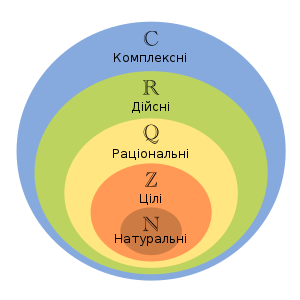

# Дійсні числа

## Натуральні числа
**Натуральні числа** - це ті, якими ми рахуємо предмети: 1,2,3,4....  
Вони нам потрібні, щоб розраховувати кількість предметів, а також площу, час, відстань, температуру, тощо.

Наприклад, до вас на свято завітали ваши родичі і ви збираєтесь всі разом їхати до аквапарку. У вашого батька є автомобіль. Проте в автомобіль може сісти лише 5 людей. Для того, щоб зрозуміти, чи всі помістяться в автомобіль (чи треба виклакати таксі) необхідно полічити всіх гостей, а далі - порівняти отримане значення із числом 5. Якщо кількість гостей та вашої родини більше 5, то треба викликати таксі.
Тобто, що вдома є ваш тато та мама, ви, а до вас завітала ваша тітка із вашим двоюрідним братом - то ви зможете разом поїхати на татовій машині.
Але, якщо до вас завітли ще й бабуся із дідусем - то вже треба забезпечити додатковий транспорт.

Математика - дуже важлива і дозволяє вам приймати в житті вірні рішення.

Чи треба викликати таксі, якщо всього на святи присутні 4,5,7,10 гостей?
Якщо перефразувати математично, то який знай треба поставити між цифрами:
|Кількість гостей | знак | кількість місць в машині|Треба таксі?|
|:---:|:---:|:---:|:---:| 
|4| < |    5|Не треба|
|5| = |    5|Не треба|
|7| > |    5|Треба|
|6|  |    5|Треба|
|9|  |    5|Треба|
|3|  |    5|Треба|
|10|  |    5|Треба|
|12|  |    5|Треба|
|15|  |    5|Треба|

Який знак показує, що нам треба 

## Додаткові завдання:
1. Вирішіть попереднє завдання за умови, що у вашого батька Mitsubishi Outlander на 7 місць
   
2. Вирішіть попереднє завдання за умови, що у вашого батька Mitsubishi Outlander на 7 місць, а також до вас завітав ваш дядко в якого автомобіль на 5 місць.

## Операції з натуральними числами.