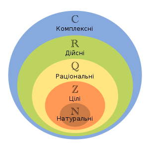
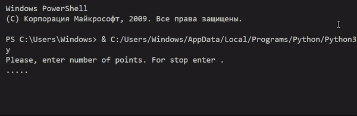

# Дійсні числа


## Натуральні числа
**Натуральні числа** - це ті, якими ми рахуємо предмети: 1,2,3,4....  
Вони нам потрібні, щоб розраховувати кількість предметів, а також площу, час, відстань, температуру, тощо.

Що дозволяють зробити натуральні числа?  
Вони необхідні, щоб закодувати кількість предметів, записати це кодування, для того, щоб зберегти значення.  
Ви можете записти кількість яблук, конфет або олівців.  


Скільки яблук?  


Відповідь:
**7**

|Зображення|Кількість яблук|
|:---:|:---:|
| | 2 |
| | 3 |
| | 4 |
| |  |
| |  |
| |  |
| |  |
| |  |
| |  |
| |  |


## Python-програма
```python
import random

while True:
    a = random.randint(1, 10)
    strn = ''
    for i in range (a):
        strn +='.'
    si = input("Please, enter number of points. For stop enter .\n"+strn+"\n")
    if si == '.':
        break
    if a==int(si):
        print("true")
    else:
        print("false")
```



