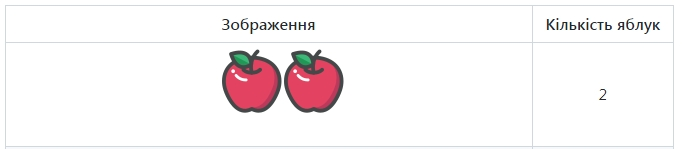

# Інтеравтивні тренажери 
## Відображення кількості
Робимо інтерактивним завдання, в якому студент має вказати кількість предметів.   

Ліворуч - з'являється кількість предметів, праворуч - студент пише цифру. За правильну відповідь - отримує кількість балів, яка розраховується за формулою (tср/tреаакції), де tср - це середня швидкість виконання завдання (за замовчуванням дорівнює 100 мс), а tреаакції це швидкість введення відповідної цифри.
  
  

## Порівняння кількості предметів в групі
Тренажер схожий на попередній, проте студент вводить не число, а знак порівняння (для якості появи картинок - робимо їх із передзавантаженням)

  

## Порівняння чисел
Тренажер аналогічний попередньому, проте порівнянню підлягають числа.  
  

