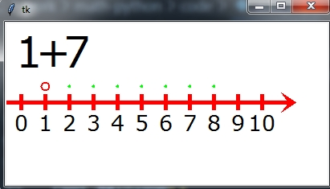
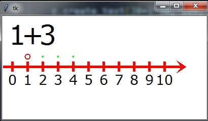
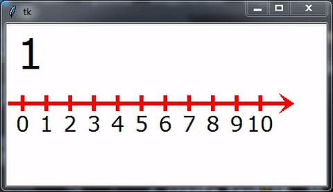

## Складання
Із числами можна проводити дії.  
  
Для того, щоб обрахунки - використовують числову пряму. Якщо ви хочете додати до числа 1 значення 3, вам необхідно знайти пункт, що відповідає числу 1 та зробити 3 кроки вправо. Отримуємо 4.  


|Додатне 1| Знак | Додатне 2 | = | результат |
|:---:|:---:|:---:|:---:|:---:|
| 1 | + | 3 | = | 4 |
| 1 | + | 7 | = | 8 |
| 3 | + | 4 | = | 7 |
| 2 | + | 2 | = |  |
| 3 | + | 5 | = |  |
| 5 | + | 3 | = |  |
| 6 | + | 3 | = |  |
| 2 | + | 5 | = |  |
| 5 | + | 4 | = |  |
| 5 | + | 5 | = |  |

## Демонстрація.
Для того, щоб зробити відповідні оператори - використайте заготовлену програму на Python.  Для цього - скопіюйте в 2 файли:

1. Встановити Python на комп'ютер
2. Встановити Git Bash
3. Встановити бібліотеку TKinter (pip install tk)
4. Завантажити біблітоеку:


Файл **add_exp.py**
```py
# !/usr/bin/python3
from tkinter import *
root = Tk()
 
c = Canvas(root, width=200, height=200, bg='white')
c.pack()

def expression(add1,add2):
    res = add1 + add2
    # Start
    c.after(500)
    c.update()
    # First digit
    c.create_text(30, 35, text=add1, 
                justify=CENTER, font="Verdana 40")
    # Circle for first digit
    c.create_oval(15+add1*30, 85, 25+add1*30, 75, outline="#f00",
                fill="#fff", width=2)

    c.after(500)
    c.update()

    # Operator
    c.create_text(60, 35, text="+", 
                justify=CENTER, font="Verdana 40")

    c.after(500)
    c.update()

    # Second digit
    c.create_text(90, 35, text=add2, 
                justify=CENTER, font="Verdana 40")

    c.after(500)
    c.update()

    # Points for addition
    for i in range(add1+1,add1+add2+1):
        c.create_oval(19+i*30, 81, 21+i*30, 79, outline="#0f0",
                fill="#fff", width=2)
        c.after(100)
        c.update()

    c.after(1000)
    c.update()

    # Clear point
    point_clear(add1)

    # Addition big point
    for i in range(add1+1,res):
        point(i)
        c.after(500)
        c.update()
        point_clear(i)
    point(add1 + add2)
    
    # placement equal sign
    c.create_text(120, 35, text="=", 
                justify=CENTER, font="Verdana 40")
    root.mainloop()

    # pont painting
def point(x):
    c.create_oval(15+x*30, 85, 25+x*30, 75, outline="#f00",
                fill="#0f0", width=2)
    c.create_text(150, 35, text=x, 
                justify=CENTER, font="Verdana 40")

    # point clarning
def point_clear(x):
    c.create_oval(15+x*30, 85, 25+x*30, 75, outline="#fff",
                fill="#fff", width=2)
    
    c.create_rectangle(135,10,165,60,fill='white',outline="#fff")

def coordinate_line():
    c.create_line(0, 100, 200, 100, fill='red',
                    width=5, arrow=LAST, 
                    activefill='#AA0000',
                    arrowshape="10 20 10")

    for i in range(6):
        c.create_line(20+i*30, 110, 20+i*30, 90, fill='red',
                    width=5,  
                    activefill='#AA0000',
                    arrowshape="10 20 10")

        c.create_text(20+i*30, 125, text=i, 
                    justify=CENTER, font="Verdana 20")

```

Створити файл для виконання:

Файл **task01.py**
```py
import add_exp

add_exp.coordinate_line()
add_exp.expression(0,4)
```



