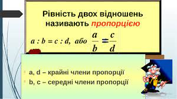
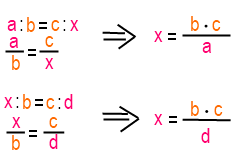

# Пропорції
Пропорції - дозволяють передбачати майбутнє!  
Як саме?  
Якщо ви знаєте, що за годину проходите 5 кілометрів, то за 2 години - ви пройдете 10 кілометрів, а півгодини - 2,5 кілометри.  
В нашому випадку - є пропорція:
5 кілометрів за одну годину. Відповідно, якщо ви збільшите кільеість годин, впродовж яких будете рухатись, то і відстань змінисья пропорційно збільшенню кількості годин.
Ві рухаєтесь зі швидкістю 5 кіломентів на годину. Скільки кілометрів ви зможете пройти за 2 години?
X = (5/1)*2

### Задачі

#### Знайдіть відношення:
1. 3м : 2м; 

2. 2коп : 25коп; 

3. 20 : 45; 

4. 10дм : 2см; 

5. 120г : 240г;

6. 21м :7дм.

#### Вирішіть із використанням правопису:
Задача 1. Щоб засіяти 8га поля , витратили 14 ц зерна. Скільки потрібно зерна, щоб засіяти 12га поля?  
  
Задача 2. Банк сплачує 25 % річних. Скільки одержить клієнт прибутку через один рік, якщо поставив у банк 220 грн.?
 

Задача 3. Службовець сплачує медичну страховку у розмірі 120 грн., що становить 15 % його заробітної плати. Яка заробітна плата у службовця?

Задача 4. Для приготування варення беруть смородину, малину та цукор у відношенні 3:4:5. Скільки кілограмів кожного продукту потрібно взяти, щоб отримати 24кг готового варення?

Задача 5. Визначити скільки потрібно взяти цементу, піску й щебеню для виготовлення 140м3 бетону, якщо за об’ємом вони знаходяться у відношенні 1:2:4?

Задача 6. За 5 год. у млині змололи 45 т. борошна. Скільки тонн борошна можна змолоти за 7 год.?

-+*****************************************9\*-+++++++++++++++++

Задача 7. З 0,5 т руди можна виплавити 0,3 т чавуну. Скільки тонн чавуну можна виплавити з 3 т руди?

\

Задача 8. Для виготовлення порцеляни беруть 25 частин глини білої, 2 частини піску і одну частину гіпсу. Скільки кожного з цих матеріалів треба взяти, щоб отримати 280кг суміші, з якої виготовляють порцеляну? (2 бали)

\